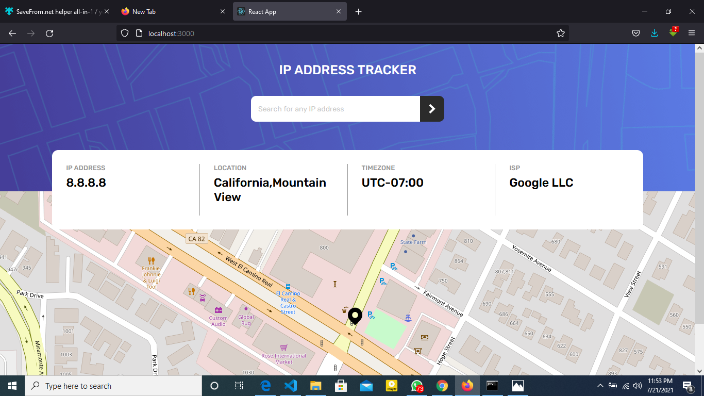

# Frontend Mentor - IP address tracker solution

This is a solution to the [IP address tracker challenge on Frontend Mentor](https://www.frontendmentor.io/challenges/ip-address-tracker-I8-0yYAH0). Frontend Mentor challenges help you improve your coding skills by building realistic projects. 

## Table of contents

- [Overview](#overview)
  - [The challenge](#the-challenge)
  - [Screenshot](#screenshot)
  - [Links](#links)
- [My process](#my-process)
  - [Built with](#built-with)
  - [What I learned](#what-i-learned)
  - [Continued development](#continued-development)
  - [Useful resources](#useful-resources)
- [Author](#author)
- [Acknowledgments](#acknowledgments)

**Note: Delete this note and update the table of contents based on what sections you keep.**

## Overview

### The challenge

Users should be able to:

- View the optimal layout for each page depending on their device's screen size
- See hover states for all interactive elements on the page
- See their own IP address on the map on the initial page load
- Search for any IP addresses or domains and see the key information and location

### Screenshot

### Links

- Solution URL: [Add solution URL here](https://your-solution-url.com)
- Live Site URL: [Add live site URL here](https://your-live-site-url.com)

### Built with

- Semantic HTML5 markup
- CSS custom properties
- Flexbox
- CSS Grid
- Mobile-first workflow
- [React](https://reactjs.org/) - JS library
- React Leaflet
- Ipify
**Note: These are just examples. Delete this note and replace the list above with your own choices**

### Continued development

-React animations and transitions

-Css styling assymetrical pages

### Useful resources

- (https://stackoverflow.com/questions/67552020/how-to-fix-error-failed-to-compile-node-modules-react-leaflet-core-esm-pat) - 
Had Issues with react leaflet parsing properly. link helped me make some changes to my package.json to fix my issue

## Author

- Website - [Adeyemi Opeyemi David](http://dayyvo.pythonanywhere.com)
- Frontend Mentor - [@Dayvvo](https://www.frontendmentor.io/profile/Dayvvo)
- Twitter - [@Dayvvo1](https://www.twitter.com/Dayvvo1)

